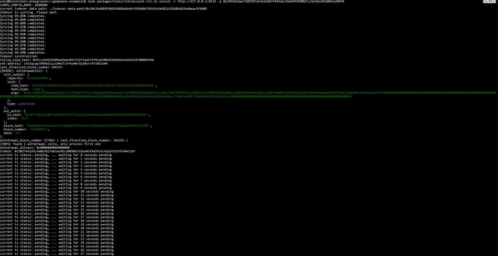
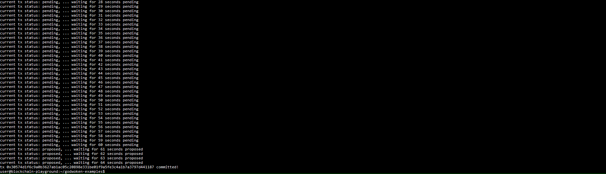

# Gitcoin Nervos Hackathon - Task 10 - Complete Withdrawal Process By Unlocking The Funds

## Task Submission

### A screenshot of the console output immediately after running the "unlock" command

### The Ethereum address that you've used for your Layer 2 account (in text format)
0xcfE381D4baf9ba00310Bba05D64DA7088A472EbE

### The Nervos Layer 1 address associated with the private key passed to "unlock" command (in text format). This is "ckb address" in the console output
ckt1qyqqr849a2zuzx94w7c3r4y8mr2pj0urr67s03le0n
