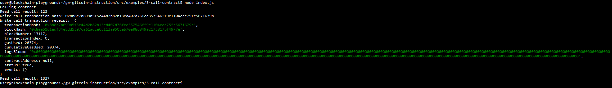

# Gitcoin Nervos Hackathon - Task 3 - Issue A Smart Contract Call To The Deployed Smart Contract

## Task submission

### A screenshot of the console output immediately after you have successfully issued a smart contract call


### The transaction hash from the console output (in text format)
0x8b8c7a699a5f5c44d2b82b13ed407d76fce357546ff9e1104cce75fc5671679b

### The contract address that you called (in text format)
0xc1716bce069787D6398BC8DFC399400C25c67eFB

### The ABI for contract you made a call on (in text format)
```json
[
  {
    "inputs": [],
    "stateMutability": "payable",
    "type": "constructor"
  },
  {
    "inputs": [
      {
        "internalType": "uint256",
        "name": "x",
        "type": "uint256"
      }
    ],
    "name": "set",
    "outputs": [],
    "stateMutability": "payable",
    "type": "function"
  },
  {
    "inputs": [],
    "name": "get",
    "outputs": [
      {
        "internalType": "uint256",
        "name": "",
        "type": "uint256"
      }
    ],
    "stateMutability": "view",
    "type": "function"
  }
]
```
