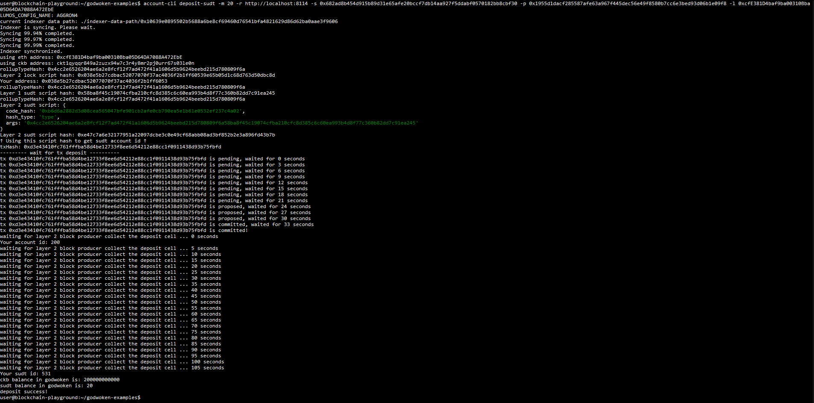

# Gitcoin Nervos Hackathon - Task 4 - Issue An SUDT Token On Layer 1 And Deposit It To Layer 2

## Task Submission

### 1) A link to the Layer 1 address you funded on the Testnet Explorer
https://explorer.nervos.org/aggron/address/ckt1qyqqr849a2zuzx94w7c3r4y8mr2pj0urr67s03le0n

### 2) A screenshot of the console output immediately after using sudt-cli to create your SUDT tokens on Layer 1

### 3) A link to the transaction ID created by sudt-cli on the Testnet Explorer
https://explorer.nervos.org/aggron/transaction/0x4837d77f0d3bd297d1d33deb70a32f7e1fbda54710149cb0049305ff3d653d99

### 4) A screenshot of the console output immediately after you have successfully submitted a deposit to Layer 2 using the account-cli tool

### 5) The SUDT ID from the console output after executing the deposit script (in text format)
531
