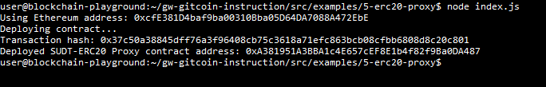
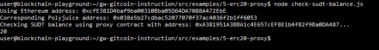

# Gitcoin Nervos Hackathon - Task 5 - Deploy The ERC20 Proxy Contract For The Deposited SUDT

## Task submission

### A screenshot of the console output immediately after deploying smart contract

### The address of the ERC20 Proxy Contract you deployed (in text format)
0xA381951A3BBA1c4E657cEF8E1b4f82f9Ba0DA487

### A screenshot of the console output immediately after checking your SUDT balance

### The Ethereum address that was checked (in text format)
0xcfE381D4baf9ba00310Bba05D64DA7088A472EbE
