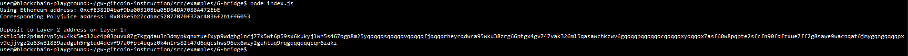

# Gitcoin Nervos Hackathon - Task 6 - Use Force Bridge To Deposit Tokens From Ethereum To Polyjuice

## Task Submission

### A screenshot of the console output immediately after you have successfully generated your Deposit Receiver Address

### Your Deposit Receiver Address (in text format)
ckt1q3dz2p4mdrvp5ywu4kk5edl2uc4p03puvx07g7kgqdau3n3dmypkqnxzuefxyp9wdghglncj77k5wt6p59sx6kukyjlwh5s467qgp8m25yqqqqqsqqqqqvqqqqqfjqqqqrheyrqdwra95wku38zrg66ptgx4gv747vak326ml5qasawchkzwv6gqqqqpqqqqqqcqqqqqxyqqqqx7asf60w8pqpte2sfcfn90fdfzxue7ff2g8sawe9wacnqat6jmygqngqqqqpxv9ejjvgz2u63w3l839aadguh5rgtqd4devf97a0fpt4uqsz0k4nlrs82t47d6qqcshws96ex6wzy2guhtuq9rqgqqqqqqcqr6zakz

### The Ethereum address used to generate the Deposit Receiver Address (in text format)
0xcfE381D4baf9ba00310Bba05D64DA7088A472EbE

### A link to the Etherscan explorer for the successful Force Bridge transaction. This can be found on Force Bridge under History→Succeed
https://rinkeby.etherscan.io/tx/0xcf00b31390b99779e99bda1e6584026f5a90689e6e8a6825d1792944d8f550bd

### A link to the Nervos explorer for the successful Force bridge transaction. This can be found on Force Bridge under History→Succeed
https://explorer.nervos.org/aggron/transaction/0xa55c40b5d5713b1a57c2d62471f271a7d33fd24bd97737c46aa4851c6b88f198
