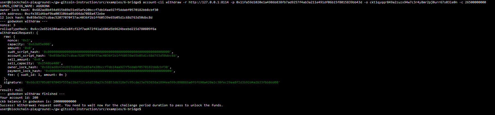

# Gitcoin Nervos Hackathon - Task 9 - Initiate Withdrawal Process From The Layer 2 Back To Layer 1

## Task submission

### A screenshot of the console output immediately after running the withdraw command

### The Ethereum address that you've used for your Layer 2 account (in text format)
0xcfE381D4baf9ba00310Bba05D64DA7088A472EbE

### The Nervos Layer 1 address that you passed to withdraw command (in text format)
ckt1qyqqr849a2zuzx94w7c3r4y8mr2pj0urr67s03le0n
